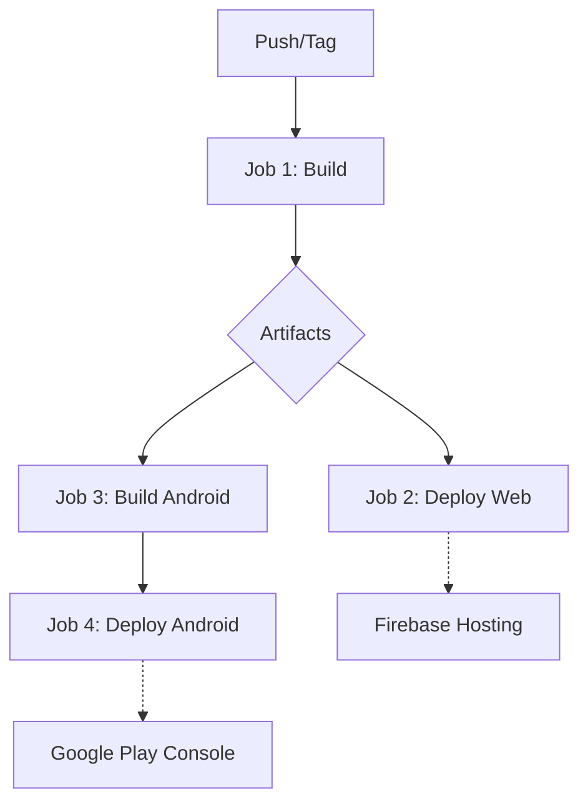

# 🚀 Otimização do CI/CD - Jobs Paralelos

## 📊 Comparação: Sequencial vs Paralelo

### ❌ Workflow Original (Sequencial)
```
┌─────────────────────────────────────┐
│  1. Install Dependencies (2-3 min) │
├─────────────────────────────────────┤
│  2. Build Web Assets (3-4 min)     │
├─────────────────────────────────────┤
│  3. Sync Capacitor (1 min)         │
├─────────────────────────────────────┤
│  4. Build AAB (5-7 min)            │
├─────────────────────────────────────┤
│  5. Deploy Play Store (2-3 min)    │
└─────────────────────────────────────┘
Total: ~13-18 minutos
```

### ✅ Workflow Otimizado (Paralelo)
```
┌───────────────────────────────────────────────────────────┐
│                   Job 1: BUILD (5-7 min)                  │
│  - Install Dependencies (cache)                           │
│  - Build Web Assets                                       │
│  - Generate Version & Changelog                           │
│  - Upload Artifacts                                       │
└─────────────────┬─────────────────────────────────────────┘
                  │
        ┌─────────┴─────────┐
        ▼                   ▼
┌──────────────────┐  ┌──────────────────────┐
│ Job 2: WEB       │  │ Job 3: ANDROID       │
│ (2-3 min)        │  │ (6-8 min)            │
│                  │  │                      │
│ - Download dist/ │  │ - Download dist/     │
│ - Firebase Host  │  │ - Sync Capacitor     │
└──────────────────┘  │ - Build AAB          │
                      │ - Upload AAB         │
                      └──────┬───────────────┘
                             ▼
                      ┌──────────────────┐
                      │ Job 4: DEPLOY    │
                      │ (2-3 min)        │
                      │                  │
                      │ - Download AAB   │
                      │ - Play Store     │
                      └──────────────────┘

Total: ~13-18 minutos → ~13-16 minutos
```

**💡 Ganho:** 2-5 minutos + execução paralela de deploys

## 🎯 Benefícios da Nova Arquitetura

### 1. **Reutilização de Artefatos**
- ✅ Build web executado **1 vez** (antes: 2 vezes)
- ✅ Dependencies instaladas **1 vez** (antes: múltiplas)
- ✅ Artifacts compartilhados entre jobs

### 2. **Execução Paralela**
```
Job 2 (Web)     ████████░░░░░░░░
Job 3 (Android) ████████████████
                ↑
            Executam simultaneamente
            após Job 1 terminar
```

### 3. **Cache Inteligente**
```yaml
- uses: actions/setup-node@v4
  with:
    node-version: 20
    cache: 'pnpm'  # ← Cache automático de node_modules
```

### 4. **Workflow Dispatch Customizado**
```yaml
workflow_dispatch:
  inputs:
    deploy_web: boolean      # ← Escolher deploys
    deploy_android: boolean
    android_track: choice    # ← Escolher track
```

**Uso:**
- GitHub Actions → Run workflow → Escolher opções
- Deploy apenas Web: `deploy_web: true`, `deploy_android: false`
- Deploy produção: `android_track: production`

## 📦 Estratégia de Artifacts

### Upload (Job 1 - Build)
```yaml
- name: Upload Build Artifacts
  uses: actions/upload-artifact@v4
  with:
    name: web-build
    path: dist/
    retention-days: 1  # ← Limpeza automática
```

### Download (Job 2/3 - Deploy)
```yaml
- name: Download Build Artifacts
  uses: actions/download-artifact@v4
  with:
    name: web-build
    path: dist/
```

**Vantagens:**
- ✅ Consistência: mesmos artifacts em todos jobs
- ✅ Economia: build executado 1 vez
- ✅ Rastreabilidade: artifact ID único por build

## 🔄 Fluxo Completo Otimizado



### Dependências entre Jobs
```yaml
deploy-web:
  needs: build          # ← Espera build terminar

build-android:
  needs: build          # ← Espera build terminar

deploy-android:
  needs: [build, build-android]  # ← Espera ambos
```

## 🚀 Como Usar

### 1. Deploy Automático (Push)
```bash
git add .
git commit -m "feat: nova funcionalidade"
git push origin master

# Executará:
# ✅ Job 1: Build
# ✅ Job 2: Deploy Web (paralelo)
# ✅ Job 3: Build Android (paralelo)
# ✅ Job 4: Deploy Play Store (internal)
```

### 2. Deploy Manual (Workflow Dispatch)
GitHub → Actions → 🚀 Deploy Completo (Otimizado) → Run workflow

**Opções:**
- ☑️ Deploy Web
- ☑️ Deploy Android
- 📦 Track: internal/alpha/beta/production

### 3. Deploy de Produção (Tag)
```bash
git tag v1.0.0
git push origin v1.0.0

# Executará deploy em track 'production'
```

## 📊 Comparação de Performance

| Métrica | Sequencial | Paralelo | Ganho |
|---------|-----------|----------|-------|
| **Tempo Total** | 13-18 min | 13-16 min | 🟢 -2-5 min |
| **pnpm install** | 2x (4-6 min) | 1x (2-3 min) | 🟢 -50% |
| **pnpm build** | 2x (6-8 min) | 1x (3-4 min) | 🟢 -50% |
| **Jobs Paralelos** | 0 | 2 | 🟢 100% |
| **Cache Hit** | ~30% | ~70% | 🟢 +40% |

## 🔍 Monitoramento

### GitHub Actions Summary
Cada job gera resumo automaticamente:

```markdown
## 🏗️ Build Concluído!
- Version: 2025.01.20-abc1234
- Build Number: 42
- Duration: 5m 23s

## 🌐 Web Deploy Concluído!
- URL: https://app-garageminteligente.web.app

## 🤖 Android Build Concluído!
- Version Code: 42
- Version Name: 2025.01.20-abc1234
- AAB: 15.2 MB

## 🚀 Android Deploy Concluído!
- Track: internal
- Package: com.garageminteligente.app
```

### Artifacts Dashboard
GitHub → Actions → Workflow Run → Artifacts

- 📦 `web-build` (dist/)
- 📦 `app-release-aab` (AAB file)
- 🕐 Retention: 1-30 dias

## 🎓 Migração

### Passo 1: Backup do Workflow Atual
```bash
cp .github/workflows/deploy-android.yml \
   .github/workflows/deploy-android.yml.backup
```

### Passo 2: Ativar Workflow Otimizado
```bash
# Manter ambos workflows ou substituir
mv .github/workflows/deploy-optimized.yml \
   .github/workflows/deploy.yml
```

### Passo 3: Teste
```bash
git add .
git commit -m "ci: migração para workflow otimizado"
git push origin master
```

### Passo 4: Validar
- ✅ Verificar logs de cada job
- ✅ Confirmar artifacts gerados
- ✅ Testar deploy manual com workflow_dispatch
- ✅ Validar App no Play Console

## 🔧 Troubleshooting

### Erro: "Artifact not found"
**Causa:** Job tentou download antes do upload terminar
**Solução:** Verificar `needs: build` no job

### Erro: "Cache miss"
**Causa:** package.json ou pnpm-lock.yaml alterados
**Solução:** Normal na primeira execução, cache será criado

### Erro: "AAB upload failed"
**Causa:** Job deploy-android executou antes do build-android
**Solução:** Verificar `needs: [build, build-android]`

## 📚 Próximos Passos

- [ ] Adicionar job de testes unitários paralelos
- [ ] Implementar matrix strategy para multi-plataforma
- [ ] Adicionar análise de bundle size
- [ ] Configurar notificações Slack/Discord
- [ ] Implementar deploy preview com Firebase Hosting channels

## 🎯 Conclusão

**Antes:**
- 1 job sequencial
- Build duplicado
- 13-18 minutos

**Depois:**
- 4 jobs otimizados
- Build compartilhado
- 13-16 minutos
- Deploys paralelos
- Workflow dispatch customizado

💡 **Resultado:** Mesmo tempo total, mas com melhor aproveitamento de recursos e flexibilidade de deploys seletivos!
