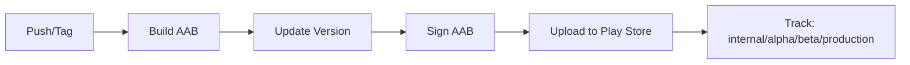

# 🤖 Configuração de CI/CD para Google Play Store

## 📋 Pré-requisitos

### 1. **Service Account no Google Cloud**

1. Acesse [Google Cloud Console](https://console.cloud.google.com)
2. Selecione o projeto do Firebase
3. Vá em **IAM e Admin** → **Service Accounts**
4. Clique em **Create Service Account**:
   - **Nome**: `github-actions-deploy`
   - **Descrição**: `Service account for GitHub Actions deployment`
5. Clique em **Create and Continue**
6. Adicione o papel: **Service Account User**
7. Clique em **Done**

### 2. **Criar Chave JSON da Service Account**

1. Na lista de Service Accounts, clique nos 3 pontos da conta criada
2. Selecione **Manage Keys**
3. Clique em **Add Key** → **Create new key**
4. Selecione **JSON**
5. Baixe o arquivo JSON (será usado como secret `GOOGLE_PLAY_SERVICE_ACCOUNT`)

### 3. **Configurar Acesso na Play Console**

1. Acesse [Google Play Console](https://play.google.com/console)
2. Vá em **Usuários e permissões**
3. Clique em **Convidar novos usuários**
4. Cole o e-mail da Service Account (algo como `github-actions-deploy@seu-projeto.iam.gserviceaccount.com`)
5. Selecione as permissões:
   - ✅ **Visualizar informações do app**
   - ✅ **Gerenciar versões de produção**
   - ✅ **Gerenciar versões de teste**
6. Clique em **Convidar usuário** → **Enviar convite**

## 🔐 Secrets do GitHub

Configure os seguintes secrets no repositório:

### Acessar GitHub Secrets
1. Vá para o repositório no GitHub
2. **Settings** → **Secrets and variables** → **Actions**
3. Clique em **New repository secret**

### Secrets Necessários

#### **Firebase Secrets** (já configurados)
```
VITE_FIREBASE_API_KEY
VITE_FIREBASE_AUTH_DOMAIN
VITE_FIREBASE_PROJECT_ID
VITE_FIREBASE_STORAGE_BUCKET
VITE_FIREBASE_MESSAGING_SENDER_ID
VITE_FIREBASE_APP_ID
VITE_FIREBASE_MEASUREMENT_ID
```

#### **Android Signing Secrets** (NOVOS)

1. **`GOOGLE_SERVICES_JSON`**
   ```bash
   # Conteúdo do arquivo android/app/google-services.json
   cat android/app/google-services.json
   ```
   Cole o JSON completo no secret.

2. **`ANDROID_KEYSTORE_BASE64`**
   ```bash
   # Encode do keystore em base64
   base64 -w 0 android/app/upload-keystore.jks
   ```
   Cole o resultado no secret.

3. **`ANDROID_KEYSTORE_PASSWORD`**
   - A senha do keystore (a que você usa no `./scripts/build-aab.sh`)

4. **`ANDROID_KEY_PASSWORD`**
   - A senha da chave (normalmente igual ao keystore password)

5. **`ANDROID_KEY_ALIAS`**
   - O alias da chave (provavelmente `upload`)

#### **Google Play Deploy Secret** (NOVO)

6. **`GOOGLE_PLAY_SERVICE_ACCOUNT`**
   ```bash
   # Conteúdo do arquivo JSON baixado da Service Account
   cat ~/Downloads/seu-projeto-xxxxx.json
   ```
   Cole o JSON completo no secret.

## 🚀 Como Usar

### **Deploy Automático**

O CI/CD será acionado automaticamente quando você fizer push:

```bash
# Deploy para Internal Testing
git checkout master
git add .
git commit -m "feat: nova funcionalidade"
git push origin master

# Ou crie uma branch específica
git checkout -b release/android
git push origin release/android
```

### **Deploy Manual (com escolha de track)**

1. Vá para **Actions** no GitHub
2. Selecione **🤖 Deploy Android (Google Play)**
3. Clique em **Run workflow**
4. Escolha o track:
   - **internal**: Teste interno (padrão)
   - **alpha**: Alpha testing
   - **beta**: Beta testing
   - **production**: Produção
5. Clique em **Run workflow**

### **Tags para Releases**

```bash
# Criar uma release com tag
git tag v1.0.0
git push origin v1.0.0
```

## 📊 Fluxo de Deploy



### **Tracks Disponíveis**

1. **Internal**: Até 100 testadores, disponível imediatamente
2. **Alpha**: Testadores limitados, review rápido
3. **Beta**: Testadores amplos, review rápido
4. **Production**: Todos os usuários, review completo do Google

## 📝 Atualizando Release Notes

Edite o arquivo para aparecer no Google Play:

```bash
# android/whatsnew/whatsnew-pt-BR
vim android/whatsnew/whatsnew-pt-BR
```

Exemplo:
```
✨ Novo sistema de manutenções
🐛 Correções de bugs no login com Google
⚡ Melhorias de performance
```

## 🔍 Verificar Deploy

Após o deploy:

1. Acesse [Google Play Console](https://play.google.com/console)
2. Vá em **Versões** → **Internal testing** (ou outro track)
3. Você verá a nova versão disponível
4. Clique em **Ver detalhes** para conferir

## ❗ Troubleshooting

### **Erro: "Package not found"**
- Certifique-se de que o `packageName` no workflow é `com.garageminteligente.app`
- Verifique se o app já foi publicado manualmente pelo menos uma vez

### **Erro: "Service account not authorized"**
- Verifique se a Service Account foi adicionada na Play Console
- Confirme que as permissões foram concedidas

### **Erro: "Invalid keystore"**
- Verifique se o base64 do keystore está correto:
  ```bash
  echo "$ANDROID_KEYSTORE_BASE64" | base64 -d > test.jks
  keytool -list -v -keystore test.jks
  ```

### **Build falhou**
- Veja os logs no GitHub Actions
- Verifique se todos os secrets estão configurados
- Confirme que o `google-services.json` é válido

## 📈 Versioning Automático

O CI gera automaticamente:
- **Version Code**: Número do build do GitHub Actions (incremental)
- **Version Name**: Data + commit SHA (`2025.10.20-abc1234`)

Exemplo:
```
Version Code: 42
Version Name: 2025.10.20-a1b2c3d
```

## 🎯 Próximos Passos

1. Configure os secrets no GitHub
2. Faça o primeiro deploy manual:
   ```bash
   ./scripts/build-aab.sh
   ```
   E suba manualmente na Play Console

3. Depois, deixe o CI fazer tudo automaticamente! 🚀
