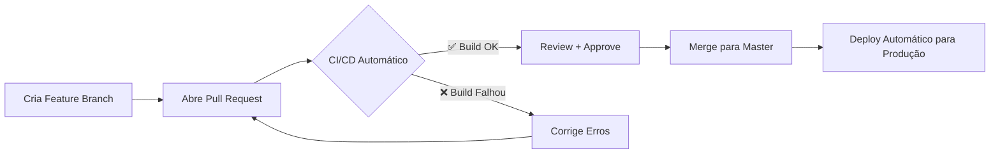

# 🔄 Workflow de Pull Requests

## Objetivo

Validar todas as mudanças através de CI/CD **antes de mergear para master**, garantindo que:
- ✅ O código compila sem erros
- ✅ Os builds de produção são bem-sucedidos (web e Android)
- ✅ Nenhum deploy para produção acontece nos PRs

---

## Como Funciona

### 1. Quando você abre um Pull Request

Ao abrir um PR para `master` ou `release/android`, o workflow **automaticamente executa**:

```yaml
✅ build              # Compila o código e testa se há erros
✅ build-android      # Gera o AAB para Android (apenas teste, não publica)
❌ deploy-web         # NÃO EXECUTA em PRs
❌ deploy-android     # NÃO EXECUTA em PRs
```

### 2. Quando você merga para master

Após aprovar e mergear o PR:

```yaml
✅ build              # Compila o código
✅ deploy-web         # Faz deploy para Firebase Hosting (produção)
```

### 3. Quando você merga para release/android

Para releases Android:

```yaml
✅ build              # Compila o código
✅ build-android      # Gera o AAB
✅ deploy-android     # Publica na Google Play Store
```

---

## Benefícios

### 🛡️ Segurança
- Nenhum deploy acidental em PRs
- Validação completa antes do merge
- Histórico claro de quando cada deploy aconteceu

### 🐛 Detecção Precoce de Erros
- Descobre problemas de build **antes** de mergear
- Evita quebrar a branch principal
- Reduz tempo de correção (feedback imediato)

### 📊 Transparência
- Vê exatamente quais checks passaram/falharam no PR
- Status claro de build/deploy no GitHub
- Logs completos para debugging

---

## Exemplo de Fluxo de Trabalho



### Passo a Passo Prático

1. **Crie uma branch de feature**
   ```bash
   git checkout -b feature/nova-funcionalidade
   ```

2. **Faça suas mudanças e commit**
   ```bash
   git add .
   git commit -m "feat: adiciona nova funcionalidade"
   git push origin feature/nova-funcionalidade
   ```

3. **Abra um Pull Request no GitHub**
   - Vá para o repositório no GitHub
   - Clique em "Compare & pull request"
   - Preencha a descrição do PR
   - O CI/CD **automaticamente inicia**

4. **Aguarde os checks passarem**
   - ✅ Veja os jobs de build executando
   - 📊 Acompanhe os logs se algo falhar
   - 🔧 Faça correções se necessário (volta ao passo 2)

5. **Após aprovação, faça o merge**
   - O deploy para produção **acontece automaticamente**
   - Monitore o deploy no GitHub Actions

---

## Troubleshooting

### ❌ Build falhou no PR

**Causa comum**: Erro de TypeScript, ESLint, ou dependências

**Solução**:
1. Veja os logs do job que falhou no GitHub Actions
2. Rode localmente:
   ```bash
   pnpm type-check
   pnpm lint
   pnpm build
   ```
3. Corrija os erros e faça novo commit

### ❌ Build Android falhou

**Causa comum**: Versão do Gradle, dependências nativas, ou configuração do Capacitor

**Solução**:
1. Verifique os logs do job `build-android`
2. Teste localmente:
   ```bash
   pnpm build
   npx cap sync
   cd android && ./gradlew bundleRelease
   ```
3. Verifique `capacitor.config.ts` e `android/app/build.gradle`

### ⚠️ Deploy não executou após merge

**Possíveis causas**:
- Merge foi para branch errada (não master/release)
- Condições do workflow não foram atendidas
- Secrets faltando no repositório

**Solução**:
1. Verifique a branch de destino do PR
2. Confirme que o merge foi concluído
3. Verifique os secrets no Settings > Secrets do repositório

---

## Configuração dos Secrets

Para o workflow funcionar completamente, você precisa configurar estes secrets no GitHub:

### Para Deploy Web
```
FIREBASE_SERVICE_ACCOUNT
```

### Para Deploy Android
```
ANDROID_KEYSTORE_BASE64
ANDROID_KEYSTORE_PASSWORD
ANDROID_KEY_ALIAS
ANDROID_KEY_PASSWORD
GOOGLE_PLAY_SERVICE_ACCOUNT
```

**Como configurar**:
1. Vá em Settings > Secrets and variables > Actions
2. Clique em "New repository secret"
3. Adicione cada secret necessário

Consulte [GITHUB-SECRETS-SETUP.md](./GITHUB-SECRETS-SETUP.md) para mais detalhes.

---

## Referências

- [GitHub Actions Workflow](.github/workflows/deploy-optimized.yml)
- [CI/CD Flow](./CI-CD-FLOW.md)
- [CI/CD Optimization](./CI-CD-OPTIMIZATION.md)
- [Deploy Quick Start](./DEPLOY-QUICK-START.md)

---

**Última atualização**: Janeiro 2025  
**Autor**: AI Assistant + Developer Team
