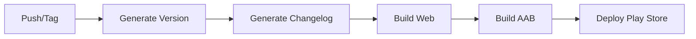

# 📝 Release Notes Automáticas - Guia Completo

## ✨ O que foi implementado

Sistema completo de **release notes automáticas** que:
- ✅ Gera changelog baseado em commits do Git
- ✅ Exibe release notes na tela "Sobre" do perfil
- ✅ Integra com CI/CD para atualização automática
- ✅ Suporta Conventional Commits
- ✅ Interface visual com tabs Info/Novidades

## 📂 Arquivos Criados/Modificados

### **Novos Arquivos**

1. **`src/constants/changelog.ts`**
   - Define interfaces do changelog
   - Lista de versões e mudanças
   - Funções helper para labels e cores

2. **`src/composables/useChangelog.ts`**
   - Composable para gerenciar changelog
   - Acesso à última versão
   - Busca de versões específicas

3. **`scripts/generate-changelog.sh`**
   - Script para gerar changelog automaticamente
   - Lê commits do Git desde última tag
   - Categoriza por tipo (feat, fix, perf, etc.)
   - Atualiza `changelog.ts` automaticamente

### **Arquivos Modificados**

1. **`src/views/ProfilePage.vue`**
   - Adicionado tab "Novidades" no modal "Sobre"
   - Exibe changelog com versões e mudanças
   - Formatação visual com badges coloridos
   - Suporte a diferentes tipos de mudanças

2. **`.github/workflows/deploy-android.yml`**
   - Adicionado step para gerar changelog
   - Executa antes do build
   - Usa versão do CI como nome da versão

## 🎨 Como Funciona

### **1. Conventional Commits**

O sistema reconhece commits no formato:
```
<tipo>(<escopo>): <mensagem>

Exemplos:
feat(auth): adicionar login com Google
fix(vehicle): corrigir validação de placa
perf(home): otimizar carregamento de dados
docs(readme): atualizar instruções
```

### **2. Tipos Suportados**

| Tipo | Badge | Cor | Descrição |
|------|-------|-----|-----------|
| `feat` | ✨ Novidade | Verde (success) | Nova funcionalidade |
| `fix` | 🐛 Correção | Vermelho (danger) | Correção de bug |
| `perf` | ⚡ Performance | Laranja (warning) | Melhoria de performance |
| `docs` | 📝 Documentação | Azul (primary) | Documentação |
| `style` | 💄 Visual | Roxo (secondary) | Mudanças visuais |
| `refactor` | ♻️ Refatoração | Cinza (tertiary) | Refatoração de código |
| `test` | ✅ Testes | Cinza (medium) | Adição de testes |
| `chore` | 🔧 Manutenção | Cinza (medium) | Tarefas de manutenção |

### **3. Geração do Changelog**

#### **Manual (desenvolvimento)**
```bash
./scripts/generate-changelog.sh "1.2.3"
```

#### **Automático (CI/CD)**
O CI/CD executa automaticamente:
```yaml
- name: 📝 Generate Changelog
  run: |
    chmod +x ./scripts/generate-changelog.sh
    ./scripts/generate-changelog.sh "${{ steps.version.outputs.VERSION_NAME }}"
```

### **4. Visualização no App**

**Tela Perfil → Sobre → Tab "Novidades":**

```
┌─────────────────────────────────────┐
│  Info  |  Novidades                 │
├─────────────────────────────────────┤
│ 📦 v2025.10.20-a1b2c3d              │
│ 20 de outubro de 2025               │
│                                     │
│ ✨ Novidade                         │
│ Sistema de release notes automático │
│                                     │
│ 🐛 Correção                         │
│ Corrigir ícones nos cards           │
│                                     │
│ ⚡ Performance                      │
│ Otimizar carregamento da home       │
└─────────────────────────────────────┘
```

## 🚀 Uso no Desenvolvimento

### **Fazer commits com conventional commits**

```bash
# Adicionar funcionalidade
git commit -m "feat(vehicle): adicionar filtro de veículos"

# Corrigir bug
git commit -m "fix(auth): corrigir erro de logout"

# Melhorar performance
git commit -m "perf(home): reduzir chamadas ao Firebase"

# Atualizar visual
git commit -m "style(profile): melhorar layout do perfil"
```

### **Gerar changelog manualmente**

```bash
# Gerar changelog para versão específica
./scripts/generate-changelog.sh "v1.2.3"

# Ver o resultado
cat src/constants/changelog.ts
```

### **Testar no app**

```bash
pnpm dev

# Acesse:
# Perfil → Sobre → Tab "Novidades"
```

## 🤖 Uso no CI/CD

### **Deploy Automático**

Quando você faz push para `master` ou `release/android`:

```bash
git push origin master
```

O CI automaticamente:
1. ✅ Gera o changelog dos commits
2. ✅ Atualiza `src/constants/changelog.ts`
3. ✅ Builda o app com as mudanças
4. ✅ Faz deploy na Play Store

### **Fluxo Completo**



## 📝 Estrutura do Changelog

```typescript
{
  version: '2025.10.20-a1b2c3d',
  date: '2025-10-20',
  changes: [
    { type: 'feat', message: 'Sistema de release notes automático' },
    { type: 'fix', message: 'Corrigir ícones nos cards' },
    { type: 'perf', message: 'Otimizar carregamento' },
  ]
}
```

## 🎯 Boas Práticas

### **✅ Faça**

- Use conventional commits sempre
- Seja claro nas mensagens de commit
- Agrupe commits relacionados
- Faça releases frequentes
- Teste o changelog localmente

### **❌ Evite**

- Commits sem tipo (`fix:`, `feat:`, etc.)
- Mensagens genéricas ("update", "fix bug")
- Muitas mudanças em um commit
- Commits de trabalho em progresso na main

## 🔍 Troubleshooting

### **Changelog não aparece no app**

1. Verifique se `changelog.ts` foi atualizado:
   ```bash
   cat src/constants/changelog.ts
   ```

2. Faça rebuild:
   ```bash
   pnpm build
   ```

3. Limpe o cache do navegador

### **Script não encontra commits**

```bash
# Verificar se há tags
git tag

# Criar uma tag inicial
git tag v1.0.0
git push origin v1.0.0
```

### **Commits não categorizados**

Commits sem tipo aparecem como "🔧 Manutenção" (chore).

Use conventional commits:
```bash
git commit -m "feat: sua mensagem"
```

## 📚 Próximas Melhorias

- [ ] Adicionar filtro por tipo de mudança
- [ ] Busca no changelog
- [ ] Exportar changelog como PDF
- [ ] Notificações de novas versões
- [ ] Comparação entre versões

## 🎓 Referências

- [Conventional Commits](https://www.conventionalcommits.org/)
- [Semantic Versioning](https://semver.org/)
- [Keep a Changelog](https://keepachangelog.com/)

---

**Desenvolvido para Garagem Inteligente** 🚗✨
